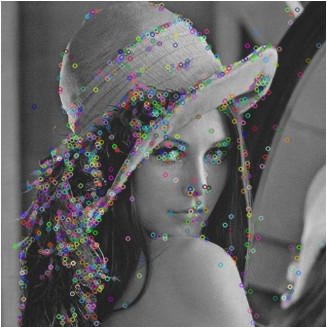
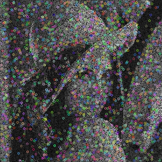
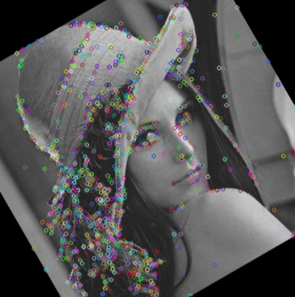
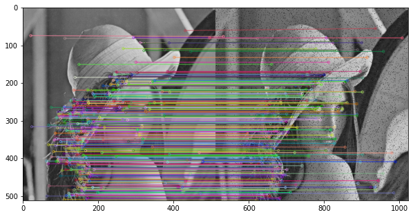
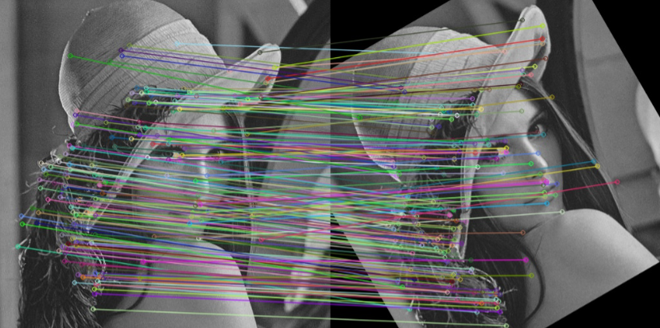
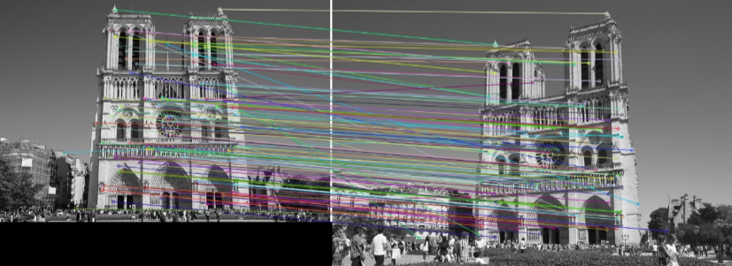

# SIFT-Feature-Extraction-Matching
Extraction of SIFT features from distorted images (noisy, rotated, changed perspective) and feature matching between original and distorted images.

## Experimental Results
### Feature Extraction
Extracted SIFT features from Original Image (L), Noisy Image - Salt and Pepper Noise (M), Rotated Image (R). 

  

    
    
     
  
 
  
  ### Feature Matching 
  * Matched Features between Original Image and Noisy Image
     

         
     
 
     
  * Matched Features between Original Image and Rotated Image
     

         
     
 

  * Matched Features between two different Perspectives of the same object
     

         
     
 

